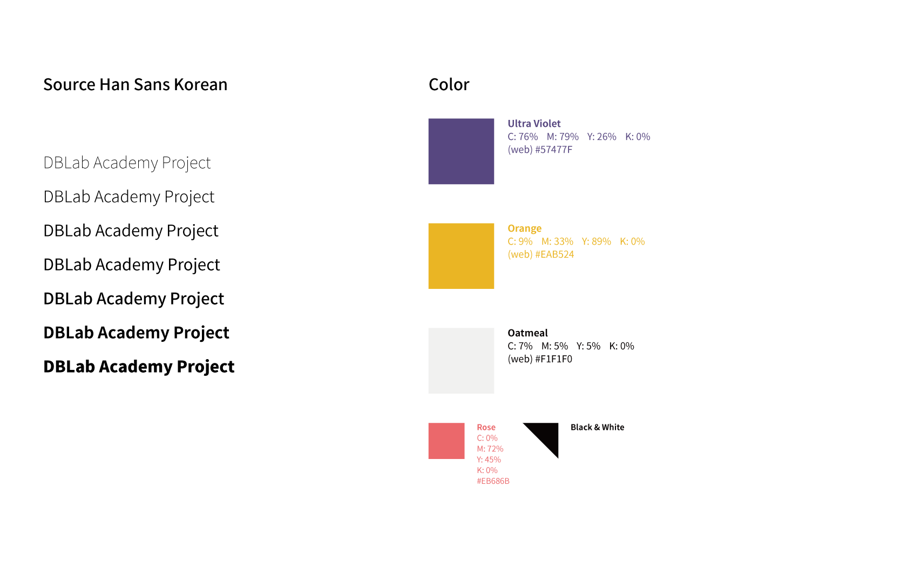

# dblab-academy-front

> A Vue.js project

## Build Setup

``` bash
# install dependencies
npm install

# serve with hot reload at localhost:8080
npm run dev

# build for production with minification
npm run build

# build for production and view the bundle analyzer report
npm run build --report

# run unit tests
npm run unit

# run e2e tests
npm run e2e

# run all tests
npm test
```

For a detailed explanation on how things work, check out the [guide](http://vuejs-templates.github.io/webpack/) and [docs for vue-loader](http://vuejs.github.io/vue-loader).

## Design Scheme



## Translation Spreadsheet Link

https://docs.google.com/spreadsheets/d/16wNDS_wWfnZjBsf50sK1tVmtoxIU9dUWwr370CVbuXI/edit?usp=sharing

## Asana Introduction

https://docs.google.com/document/d/1a7OisDdvRJMxIufXmmlBKCNICD-XVTkmtfHfGHX9GfU/edit?usp=sharing

## Asana Front-end Project Tag Description

- pending: 다른 카드가 끝나야 진행이 가능해서 기다리고 있는 카드
- planning: 현재 기획중
- %main: 메인 모듈
- %edit: 강사 저작 모듈
- %teach: 강사 강의 모듈
- %instructor: 강사 모듈 (teacher라고 하면 teach와 헷갈릴 것 같아서 일부러 구분)
- $student: 학생 모듈 (학생 수강 모듈)

## LF, CRLF Issue

https://www.lesstif.com/pages/viewpage.action?pageId=20776404

## How to Make Gitlab Merge Request

https://docs.google.com/document/d/1-33hlYAORkdUqXwEFFb2lzJKrWUXVV-xTrQpxH94BSM/edit?usp=sharing

## VSCode Extension lists

http://simp.ly/p/b2Hptz

## Git Basics

http://simp.ly/p/WzDx39

## Git Commit Message Convention

http://iamabluetiger.com/git-convention-reference/

## Frequently Used Git Commands

http://simp.ly/p/08MtVv

## Vue Seminar PPT

https://docs.google.com/presentation/d/1uASObzUH1X_5zsGINukRZ5i4z0sabNAkHY9T3X6ejmw/edit?usp=sharing
